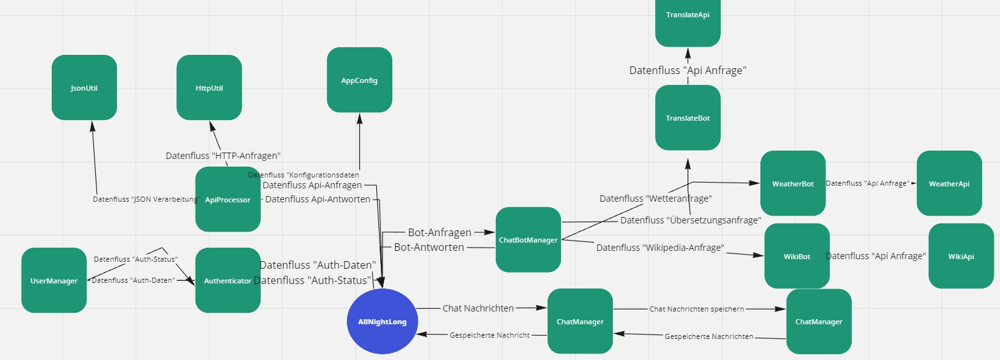
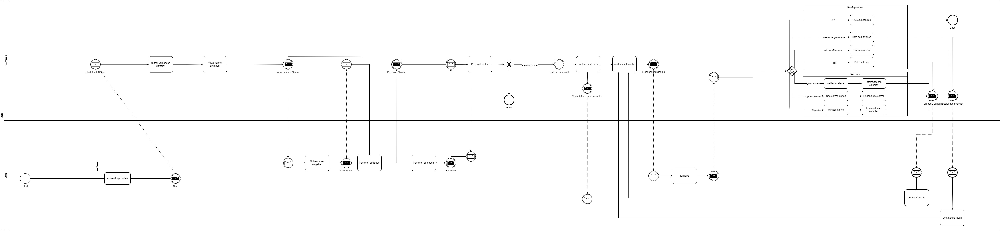

# AllNightLong


## Inhaltsverzeichnis

1. [Autoren](#autoren)
2. [Beispielbenutzer](#beispielbenutzer)
3. [Beispiel Anfrangen](#beispiel-anfrangen)
4. [Einleitung](#einleitung)
5. [Zweck des Dokuments](#zweck-des-dokuments)
6. [Kontext der Softwarearchitektur](#kontext-der-softwarearchitektur)
    - [Kontextabgrenzung](#kontextabgrenzung)
    - [Fachlicher Kontext](#fachlicher-kontext)
    - [Technischer Kontext](#technischer-kontext)
7. [Visualisierung mithilfe eines Kontextdiagramms](#visualisierung-mithilfe-eines-kontextdiagramms)
8. [UML Diagramm](#uml-diagramm)
9. [Laufzeitsichten](#laufzeitsichten)
    - [Benutzerauthentifizierung](#benutzerauthentifizierung)
    - [Hauptmenü](#hauptmenü)
10. [Kritische Schnittstellen](#kritische-schnittstellen)
11. [Infrastrukturelle Überlegungen](#infrastrukturelle-überlegungen)
    - [Grundlage und Bedeutung der Infrastruktur](#grundlage-und-bedeutung-der-infrastruktur)
12. [Querschnittliche Konzepte](#querschnittliche-konzepte)
    - [Motivation](#motivation)
    - [Form](#form)
13. [Schnittstellen](#schnittstellen)
    - [Datenbankzugriff mit SQLite](#datenbankzugriff-mit-sqlite)
14. [Auswertung](#auswertung)
15. [Risiken und technische Schulden](#risiken-und-technische-schulden)
    - [API-Abhängigkeiten](#api-abhängigkeiten)
    - [Datenbanklimitierungen](#datenbanklimitierungen)
    - [Technische Schulden und Software-Design](#technische-schulden-und-software-design)
16. [Testabdeckung](#testabdeckung)
17. [Gesamtbetrachtung](#gesamtbetrachtung)
18. [Erweiterungen](#erweiterungen)
19. [Fehlerbehebung](#fehlerbehebung)
20. [Installationsanleitung](#installationsanleitung)
    - [Konfiguration](#konfiguration)
21. [Bot-Dokumentation (Erweiterung)](#bot-dokumentation-erweiterung)
    - [Algemeine Bot-Dokumentation zu allen Bots](#allgemeine-bot-dokumentation-zu-allen-bots)
    - [WikiBot](#wikibot)
    - [TranslateBot](#translatebot)
    - [WetterBot](#wetterbot)
22. [Ausblick](#ausblick)
    - [Zukünftige Entwicklungsmöglichkeiten](#zuknftige-entwicklungsmglichkeiten)
    - [Technische Schulden und Risiken](#technische-schulden-und-risiken)
23. [Fazit](#fazit)


## Autoren

- Alexander Lunewski

### Beispielbenutzer

- Benutzername: user1
- Passwort: pass1

- Benutzername: user2
- Passwort: pass2

### Beispiel Anfrangen

 ```bash
       list bots
   ```
 ```bash
       activate bot wetterbot
   ```
 ```bash
       @wetterbot wie ist das Wetter in bielefeld
   ```
 ```bash
       activate bot wikibot
   ```
 ```bash
     @wikibot was ist bielefeld
   ```
 ```bash
       activate bot translatebot
   ```
 ```bash
     @translatebot übersetze folgendes in das englische: This work is a super performance
   ```
 ```bash
    deactivate bot translatebot
   ```
 ```bash
    @exit
   ```

## Einleitung

### Zweck des Dokuments

Willkommen zur Systemdokumentation des Projekts "AllNightLong". Das primäre Ziel dieses Dokuments ist es, eine eingehende Darstellung der Architektur, der internen Arbeitsweise und der Design-Entscheidungen des Systems zu bieten. Es soll als Referenz und Leitfaden für Entwickler, Software-Architekten und technische Projektmanager dienen, die das System verstehen, erweitern oder pflegen möchten.

### Kontext der Softwarearchitektur

"AllNightLong" ist eine modular aufgebaute Java-Anwendung, die als Chatbot-Plattform konzipiert ist. Sie integriert verschiedene Dienste—einschließlich, aber nicht beschränkt auf, Wetterinformationen, Wikipedia-Suchen und Sprachübersetzungen—um ein umfassendes Nutzererlebnis zu bieten. Die Anwendung ist so gestaltet, dass sie leicht erweiterbar ist, sodass zukünftige Dienste mit minimalem Aufwand hinzugefügt werden können.

Diese Dokumentation wird im weiteren Verlauf detailliert auf die einzelnen Module, ihre Funktionen und ihre Interaktionen eingehen, um ein vollständiges Verständnis der Systemarchitektur zu ermöglichen.

Mit der Lektüre dieser Dokumentation erhalten die Stakeholder ein tiefgehendes Verständnis für die architektonische Struktur und die Designprinzipien von "AllNightLong", was für die zukünftige Entwicklung und Wartung des Projekts von unschätzbarem Wert ist.

## Kontextabgrenzung
Die Kontextabgrenzung spielt eine entscheidende Rolle für die Entwicklung und Implementierung des "All Night Long" Systems. Sie dient als Roadmap, die alle internen und externen Interaktionen des Systems klar definiert. Im fachlichen Kontext werden die Schnittstellen und Kommunikationswege zwischen dem System und den externen Akteuren wie REST-APIs, SQLite-Datenbank und den Endnutzern beschrieben. Diese Klarheit ermöglicht es, Erwartungen zu managen und sorgt für eine effiziente und effektive Kommunikation zwischen verschiedenen Komponenten des Systems.

Auf technischer Ebene bietet die Kontextabgrenzung eine Übersicht über die technischen Schnittstellen des Systems. Hier werden die Mechanismen für den Datenbankzugriff, die HTTP-Kommunikation und die Endbenutzerinteraktion im Detail erläutert. Durch die klare Abgrenzung dieser Elemente können Entwickler und Stakeholder ein gemeinsames Verständnis für die Architektur und die Funktionsweise des Systems entwickeln.

Insgesamt stellt die Kontextabgrenzung sicher, dass alle Teammitglieder und externen Partner genau wissen, wie die verschiedenen Teile des Systems interagieren. Dies ist entscheidend für die erfolgreiche Entwicklung, Implementierung und Wartung des "All Night Long" Systems.

### Motivation
In der heutigen Zeit, in der Softwarelösungen in einem komplexen und multifunktionalen Technologieumfeld agieren müssen, gewinnt die klare Abgrenzung eines Systems gegenüber seinen Kommunikationspartnern stark an Bedeutung. Solche Kommunikationspartner können Benutzer, andere Softwareanwendungen, Datenbanken oder andere Dienste sein. Es ist von entscheidender Bedeutung, den Kontext zu verstehen, in dem ein System operiert, um die robuste und effiziente Funktion desselben sicherzustellen. Ein präzises Verständnis der fachlichen und technischen Schnittstellen ermöglicht nicht nur eine effektivere Kommunikation, sondern erleichtert auch die Systemerweiterung, Wartung und Skalierbarkeit.

### Form
Die Kontextabgrenzung für "AllNightLong" erfolgt durch eine Kombination von Methoden, darunter Kontextdiagramme und tabellarische Auflistungen, um ein umfassendes Bild der externen Kommunikationsbeziehungen und Schnittstellen des Systems zu zeichnen.

### Fachlicher Kontext

#### Externe Kommunikationspartner

- **REST-APIs (DeepL, Wikipedia, Openweather)**: "All Night Long" interagiert mit diversen externen APIs. Diese APIs werden über das `ApiProcessor`-Interface angesprochen, um spezifische Dienste wie Übersetzungen, Wetterinformationen und Wikipedia-Suchen bereitzustellen.

- **SQLite-Datenbank**: Die Datenbank speichert Chatverläufe sowie Benutzerinformationen. Die Kommunikation mit der Datenbank erfolgt über die `DatabaseManager`-Schnittstelle.

- **Endnutzer**: Der primäre Benutzer-Input und -Output erfolgt über das Terminal.

#### Fachliche Schnittstellen

- **Nutzereingabe**: Eingaben werden über das Terminal als Text eingegeben.

- **Systemausgabe**: Antworten und Informationen werden dem Nutzer über das Terminal in Textform präsentiert.

- **HTTP-Anfragen und -Antworten**: HTTP-Anfragen an die externen APIs und die entsprechenden Antworten werden über die `ApiProcessor`-Implementierungen abgewickelt.

- **Datenbankzugriff**: SQLite wird für den Zugriff auf die Datenbank verwendet, gesteuert über die `DatabaseManager`-Schnittstelle.

### Technischer Kontext

#### Technische Schnittstellen

- **Terminal**: Dient als primäre Benutzerschnittstelle für Eingabe und Ausgabe.

- **HTTP-Verbindungen**: Verwendet für Kommunikation mit externen APIs wie DeepL, Wikipedia und Openweather. Diese Verbindungen werden durch die Implementierungen des `ApiProcessor`-Interfaces abstrahiert.

- **SQLite-Datenbankverbindung**: Der Zugriff auf die Datenbank erfolgt über SQLite. Die Verwaltung dieser Verbindungen und Operationen erfolgt durch die `DatabaseManager`-Implementierung.

### Visualisierunng mithilfe eins Kontextdiagramms



### Zusammenfassung
Die Kontextabgrenzung dient als Grundlage für das Verständnis und die Weiterentwicklung des "All Night Long" Systems. Sie bietet ein klares Bild der fachlichen und technischen Aspekte, die für die Kommunikation und Interaktion mit externen und internen Entitäten relevant sind. Dies trägt dazu bei, die Komplexität zu bewältigen und Risiken zu minimieren.

### Lösungsstrategie
Unsere Lösungsstrategie ist modular und erweiterbar. Durch die Verwendung von Interfaces wie ApiProcessor und DatabaseManager wird es einfach, zusätzliche Funktionen und Dienste zu integrieren, ohne den bestehenden Code zu beeinträchtigen.

### Technologieentscheidung
Die Wahl der Technologien wurde auf Basis von Zuverlässigkeit, Skalierbarkeit und Gemeinschaftsunterstützung getroffen. SQLite wurde wegen seiner Leichtigkeit und Effizienz für kleinere Anwendungen ausgewählt. Für API-Interaktionen wurde das HTTP-Protokoll verwendet, da es weit verbreitet und gut dokumentiert ist.

### Architektur- und Entwurfsmuster

Das System folgt einer mehrschichtigen Architektur mit einer klaren Trennung zwischen Datenzugriff, Geschäftslogik und Benutzeroberfläche. Entwurfsmuster wie Singleton für DatabaseManager und Factory für die Erstellung von API-Prozessoren werden angewendet, um eine saubere und wartbare Codebasis zu gewährleisten.

### Qualitätsanforderungen
Das System ist so ausgelegt, dass es eine hohe Verfügbarkeit, Zuverlässigkeit und Benutzerfreundlichkeit bietet. Performance-Tests und Code-Reviews sollten regelmäßig durchgeführt werden, um sicherzustellen, dass das System diesen Anforderungen gerecht wird.

### Organisatorische Entscheidungen

Neben technischen Überlegungen umfasst meine Lösungsstrategie auch organisatorische Elemente, obwohl ich als einziger Entwickler an diesem Projekt gearbeitet habe. Dies beinhaltet die Planung und Strukturierung des Entwicklungsprozesses, die individuelle Aufgabendelegation und die Überwachung des Entwicklungsfortschritts. Diese selbstverwalteten Prozesse haben dazu beigetragen, die Entwicklung effizient zu gestalten, kontinuierliche Verbesserungen vorzunehmen und den Code durch wiederholte Debugging-Schritte zu optimieren.

### Motivation

Die gefällten Entscheidungen bilden das Fundament für die Planung und Umsetzung unseres Systems. Sie sind darauf ausgerichtet, die Zielvorgaben der Projektbeschreibung effizient zu realisieren, während sie zugleich eine widerstandsfähige und skalierbare Architektur ermöglichen. In den nachfolgenden Abschnitten werden diese einzelnen Entscheidungen detailliert betrachtet und ihre Einflüsse auf die Gesamtstruktur erläutert.

##Bausteinsicht

### Überblick über die Architektur
Das AllNightLong-Projekt ist modular aufgebaut und besteht aus verschiedenen unabhängigen, aber integrierten Komponenten. Die Hauptmodule sind:

### API Utility Klassen
API-Schnittstellen und Klassen
Bot-Klassen
Managementsysteme
Datenbank- und Chat-Management
Benutzerverwaltung
API Utility Klassen
Die Utility-Klassen bieten grundlegende Funktionen zur Verarbeitung von JSON (JsonUtil), zur HTTP-Kommunikation (HttpUtil), zum Kompilieren von Java-Quellcode (CompilerUtil), sowie zur Konfiguration (AppConfig).

### API-Schnittstellen und Klassen
Es gibt spezialisierte Klassen für verschiedene APIs: WikiApi für Wikipedia-Abfragen, WeatherApi für Wetterinformationen und TranslateApi für Übersetzungen. Diese Klassen implementieren jeweils spezifische Schnittstellen wie Wikiprocessor, WeatherService und TranslationProcessor.

### Bot-Klassen
Die Bot-Klassen (TranslateBot, WeatherBot, Wikibot) nutzen die API-Klassen und sind für die Beantwortung von Benutzeranfragen verantwortlich. Sie implementieren die Schnittstelle ChatBot.

### Managementsysteme
Der SimpleChatBotManager ist für die Verwaltung der verschiedenen Bot-Klassen zuständig, während der ChatManager und der SqlLiteManager für das Datenbank- und Chat-Management verantwortlich sind.

### Benutzerverwaltung
Die Benutzerauthentifizierung wird durch die SimpleUserManager- und SimpleAuthenticator-Klassen verwaltet, die die UserManager- und Authenticator-Schnittstellen implementieren.

## Beziehungen zwischen den Komponenten
Die Bot-Klassen sind von den API-Klassen abhängig.
SimpleChatBotManager verwaltet alle Bot-Klassen.
SqlLiteManager ist für die Datenbank-Interaktionen verantwortlich und wird vom ChatManager verwendet.
AppConfig wird von verschiedenen API-Klassen zur Abfrage von Konfigurationsdaten verwendet.
## Laufzeitsichten


Das vorliegende Business Process Model and Notation (BPMN) beschreibt die Benutzerinteraktionen mit der AllNightLong-Software, die drei spezialisierte Chatbots integriert. Diese Chatbots greifen auf Informationen von Wikipedia, Openweather und DeepL über APIs zu.


### Benutzerauthentifizierung
#### Anwendungsstart
Start der Anwendung: Der Prozess beginnt, wenn der Nutzer die AllNightLong-Softwareanwendung startet.

Account-Prüfung: Da es keine Option zur Registrierung gibt, wird der Nutzer direkt aufgefordert, seinen Benutzernamen und das zugehörige Passwort einzugeben.

Bei fehlerhafter Authentifizierung wird das Programm automatisch beendet.
Bei erfolgreicher Authentifizierung wird der Nutzer in das System eingeloggt und der Chatverlauf des Nutzers wird angezeigt.
### Hauptmenü
#### Eingabeaufforderung
Nach dem erfolgreichen Login und der Anzeige des Chatverlaufs wartet die Software auf die Eingabe des Nutzers. Der Nutzer hat sieben verschiedene Optionen zur Verfügung:

**Chatbot-Aktivierung:** Durch Eingabe des Befehls "activate bot [botname] kann der Nutzer einen der verfügbaren Chatbots aktivieren. Das Ergebnis der Bot-Interaktion wird dem Nutzer präsentiert, und die Software kehrt zum Warte-Status zurück.

**Bot-Übersicht:** Mit dem Befehl "list Bots" kann sich der Nutzer eine Liste aller verfügbaren Chatbots anzeigen lassen.

**Bot-Verwaltung/Konfiguration:** Mit den Befehlen "botname deactivate" und "botname activate" kann der Nutzer nicht benötigte Bots deaktivieren bzw. wieder aktivierte Bots aktivieren. Eine Bestätigungsnachricht wird im Anschluss angezeigt.

**Beenden:** Durch den Befehl @exit die Eingabe des Befehls @botname kann der Nutzer einen der verfügbaren Chatbots aktivieren. Das Ergebnis der Bot-Interaktion wird dem Nutzer präsentiert, und die Software kehrt zum Warte-Status zurück.

#### Zusatzangaben
Umfassende Informationen zu den einzelnen Chatbots sowie erweiterte Einstellungsmöglichkeiten finden Sie in den Kapiteln für Konfiguration und Bot-Dokumentation

## Kritische Schnittstellen
Die Betriebsstabilität der Software im Rahmen des AllNightLong-Projekts ist signifikant von den APIs von DeepL, Wikipedia und Openweather beeinflusst. Ausfälle oder Fehlfunktionen dieser externen Dienste haben direkte Auswirkungen auf die Qualität der bereitgestellten Informationen und Daten. Daher ist eine kontinuierliche Überwachung der Verfügbarkeit und Funktionalität dieser APIs unabdingbar.

Für eine verbesserte Lesbarkeit und Fokusierung auf den Hauptprozessfluss sind diese kritischen Abhängigkeiten in den BPMN-Diagrammen nicht separat dargestellt.

### Infrastrukturelle Überlegung
Die vorhandene technische Infrastruktur, einschließlich Prozessoren und Systemtopologie, stellt die Grundlage für die Implementierung der verschiedenen Software-Komponenten dar.

### Grundlage und Bedeutung der Infrastruktur
Softwarelösungen operieren nicht isoliert, sondern sind auf eine zugrundeliegende technische Infrastruktur angewiesen. Diese Elemente der Infrastruktur prägen sowohl die systemische Leistungsfähigkeit als auch die Gestaltungsmöglichkeiten auf einer übergeordneten Ebene und sind daher für das Projekt von fundamentaler Bedeutung.

Zur Visualisierung der infrastrukturellen Gegebenheiten sind UML-Verteilungsdiagramme ein bewährtes Instrument. Sie ermöglichen eine differenzierte Darstellung, die je nach Komplexität des Systems auch mehrstufig erfolgen kann. Für spezielle Anwendungsgebiete können jedoch auch alternative grafische Methoden in Erwägung gezogen werden.

#### UML Diagramm
![UML Diagramm](https://www.plantuml.com/plantuml/png/pLTHRzis47xNh-1RN2pE3oWChwwtO4sJD8jN57iQpj9LvYQH2acb2DR-zv4IR-AP0ceqMB4dc_VTVRpxo2EfLzQ1SNtR56TYS_T6l7UoaUv9R1km5crHXbznPRKAYFYx4EA7gzsxstVxFx5qeWDZCQ2BdJDIrI-ABqMC-SMvRee9esqZKJbH6WI7as7nWXpkyQ57Inw9XTXFTJmNnxytqAsuRPsmsKuhYwi828kg8iA4F2bkgzjEDcYc0WV1LZ-kHJb2B1Ccp1KymaxtfiHBeziHZXm7CBimbofHrEZ2UAkL2oBjjMuGLCApwJeFVfGnE1Bvi4qdt-9JiY9nRTzu9lCHIhI5fB_2EzyPxMrM6qRKZLOkR61BWdype6m3JcerJ-AYGou7u_aW_v8T9mYRR6CCF0cBOCh3OZuGmHtGYsOUPOd7GcnxOr2vw4GCp8V0Issm1EjorNWdX4ozP6ocCYpChpsQIVFv0dACL4wtyDGPv-9ezz7i5nThGJt9ZC7_oFXvpUMDsuUaesAMiHXVyXzlV_xzwnlXkKhdJgUBuGUdH5zgckq48gykAS85PdQcCRDF_KW0wSzwB0Fv5gRLeSx2u_M1eRc3OUP84msekeSQFNPI5x85kex1MrtXNRzlPFd1GDUXIPg2vSLKOWZJYIDCAGu5EUQEbD2AhxMZLapwVti0vv6n7SrmZbUBXz2ABwb6-bDyoRIbo2LB0zBLEfsM5l9VqZX-3cLet3tnKKj_6dzFupaJDw2WHcC5g4hSOosjCq-vXD6Db0nkGoqB1IqIuxdmsRoa43_HevPL23XuyWR7Cz2xtBAOhrMvastNO9u7t-8HNuSKlFqOVZtUZmEyS-1w-pqBEHC_WOCzM0mo3xnH-1QLIzGcDoPtgPN2CZw4AcdPsC8Ztg2rK5FxYjwY2TLG7ujsn0V_QsaTlMH2LzzZYSf51fjJIEL48rkPFczs3ysrTCZMOZic9RKI8R__PTv1TvRqiTmL7__tUSQ7n7i_dDyGczuTl4MMuEZf0vC95o6Iik-d_vHQdci7rdxIflBxCxuPZpljEqqvrPWIvjDzUo6ST_vA77ZjCoSz4_Sutads83lBhwtLSick5BhX2Plk1NgL1JETxKL1TzZgyyK58sB8HCFj6Gy94i3PexKeg2kuA-lvp2Uax7ac4hwBajaOmDn6batJtChwuAwrgejYMaD6afYPIqwGbpZd5l41c1SbTHVBvPfLcuCyUcvXltMJq8kAo08nDqwnt9xEMD3pYz5m8z5mEwTXNxhXyJRt-LfCtwASc0ES-HMggc-RVm00)

[PlantUML QuellCode](http://www.plantuml.com/plantuml/uml/pLTHRzis47xNh-1RN2pE3oWChwwtO4sJD8jN57iQpj9LvYQH2acb2DR-zv4IR-AP0ceqMB4dc_VTVRpxo2EfLzQ1SNtR56TYS_T6l7UoaUv9R1km5crHXbznPRKAYFYx4EA7gzsxstVxFx5qeWDZCQ2BdJDIrI-ABqMC-SMvRee9esqZKJbH6WI7as7nWXpkyQ57Inw9XTXFTJmNnxytqAsuRPsmsKuhYwi828kg8iA4F2bkgzjEDcYc0WV1LZ-kHJb2B1Ccp1KymaxtfiHBeziHZXm7CBimbofHrEZ2UAkL2oBjjMuGLCApwJeFVfGnE1Bvi4qdt-9JiY9nRTzu9lCHIhI5fB_2EzyPxMrM6qRKZLOkR61BWdype6m3JcerJ-AYGou7u_aW_v8T9mYRR6CCF0cBOCh3OZuGmHtGYsOUPOd7GcnxOr2vw4GCp8V0Issm1EjorNWdX4ozP6ocCYpChpsQIVFv0dACL4wtyDGPv-9ezz7i5nThGJt9ZC7_oFXvpUMDsuUaesAMiHXVyXzlV_xzwnlXkKhdJgUBuGUdH5zgckq48gykAS85PdQcCRDF_KW0wSzwB0Fv5gRLeSx2u_M1eRc3OUP84msekeSQFNPI5x85kex1MrtXNRzlPFd1GDUXIPg2vSLKOWZJYIDCAGu5EUQEbD2AhxMZLapwVti0vv6n7SrmZbUBXz2ABwb6-bDyoRIbo2LB0zBLEfsM5l9VqZX-3cLet3tnKKj_6dzFupaJDw2WHcC5g4hSOosjCq-vXD6Db0nkGoqB1IqIuxdmsRoa43_HevPL23XuyWR7Cz2xtBAOhrMvastNO9u7t-8HNuSKlFqOVZtUZmEyS-1w-pqBEHC_WOCzM0mo3xnH-1QLIzGcDoPtgPN2CZw4AcdPsC8Ztg2rK5FxYjwY2TLG7ujsn0V_QsaTlMH2LzzZYSf51fjJIEL48rkPFczs3ysrTCZMOZic9RKI8R__PTv1TvRqiTmL7__tUSQ7n7i_dDyGczuTl4MMuEZf0vC95o6Iik-d_vHQdci7rdxIflBxCxuPZpljEqqvrPWIvjDzUo6ST_vA77ZjCoSz4_Sutads83lBhwtLSick5BhX2Plk1NgL1JETxKL1TzZgyyK58sB8HCFj6Gy94i3PexKeg2kuA-lvp2Uax7ac4hwBajaOmDn6batJtChwuAwrgejYMaD6afYPIqwGbpZd5l41c1SbTHVBvPfLcuCyUcvXltMJq8kAo08nDqwnt9xEMD3pYz5m8z5mEwTXNxhXyJRt-LfCtwASc0ES-HMggc-RVm00)

#### Modularität und Kapselung
Die Strukturierung in spezifische Klassen wie JsonUtil, HttpUtil, und AppConfig zeigt eine deutliche Kapselung der unterschiedlichen Funktionalitäten. Diese separaten Dienstprogramme sind für spezialisierte Aufgaben wie JSON-Verarbeitung, HTTP-Anfragen und Konfigurationsverwaltung zuständig.

#### Interface-Architektur
Durch die Verwendung von Schnittstellen wie ApiProcessor, TranslationProcessor, und WeatherService wird eine hohe Modularität und Flexibilität erzielt. Diese Schnittstellen ermöglichen die Entwicklung von variablen Implementierungen, die nach dem Prinzip der „Programmierung gegen Interfaces“ ausgetauscht werden können.

#### Abhängigkeitsmanagement

Die Abhängigkeiten zwischen den verschiedenen Klassen und Interfaces sind sorgfältig modelliert. Beispielhaft hierfür steht die WeatherApi-Klasse, die nicht nur von den Utility-Klassen wie JsonUtil und HttpUtil abhängig ist, sondern auch von der AppConfig-Klasse zur Verwaltung von API-Schlüsseln.

#### Datenmanagement und Authentifizierung
Mit SqlLiteManager und SimpleUserManager wird ein robustes System für Datenmanagement und Authentifizierung vorgestellt. Diese Klassen interagieren jeweils mit spezifischen Schnittstellen (DatabaseManager und Authenticator), was wiederum die Erweiterbarkeit und Wartbarkeit des Systems unterstreicht.

#### Bot-Management
Das Bot-Management ist durch die SimpleChatBotManager-Klasse realisiert, die eine Registrierung und Abfrage von verschiedenen Bot-Implementierungen ermöglicht. Diese Bots implementieren das ChatBot-Interface und sind so modular aufgebaut, dass sie leicht erweitert oder ausgetauscht werden können.

#### Schlussfolgerung

Insgesamt stellt das UML-Diagramm eine ausgereifte und gut durchdachte Architektur dar, die Modularität, Erweiterbarkeit und Wartbarkeit in den Vordergrund stellt. Spezielle Aufmerksamkeit wurde der Trennung von Verantwortlichkeiten und der Implementierung von Interfaces gewidmet, um eine zukunftssichere und flexible Lösung zu gewährleisten.

## Querschnittliche Konzepte:

#### Modularität und Schnittstellenorientierung
Die Architektur verfolgt ein modularisiertes Design, in dem Funktionalitäten in spezifischen Klassen und Schnittstellen gekapselt sind. Dies fördert die Wiederverwendbarkeit des Codes und erleichtert die Einbindung neuer Funktionen oder die Anpassung bestehender Komponenten.

#### Architekturmuster und -stile
Die Anwendung verfolgt eine Client-Server-Architektur mit starkem Fokus auf die Serviceorientierung. Mehrere Mikrodienste, etwa für Wetterinformationen oder Übersetzungen, werden über standardisierte APIs angebunden. Das erleichtert nicht nur die Skalierbarkeit, sondern auch die Ausfallsicherheit durch redundante Systeme.

#### Technologiestacks
Ein einheitlicher Technologiestack mit Java als Programmiersprache und SQLite für die Datenbankverwaltung sorgt für Homogenität innerhalb des Systems. Ergänzend dazu werden weit verbreitete Bibliotheken und Frameworks für spezielle Aufgaben genutzt, etwa HttpClient für Netzwerkanfragen oder JSONObject zur JSON-Verarbeitung.

#### Domänenmodelle
Die Architektur implementiert ein abstraktes Domänenmodell, welches die verschiedenen Aspekte des Systems – von Benutzerinteraktion und Authentifizierung bis zu Datenmanagement und API-Integration – zusammenführt.

#### Sicherheitskonzepte
Während Sicherheitsaspekte sich nicht direkt als einzelne Bausteine repräsentieren lassen, sind sie dennoch integraler Bestandteil der Architektur. Authentifizierung und Datenverschlüsselung sind durchgehend implementiert, um die Integrität und Vertraulichkeit der Systemdaten zu gewährleisten.

#### Standard-Frameworks und Bibliotheken
Die Architektur nutzt etablierte Frameworks und Bibliotheken wie HttpClient für HTTP-Anfragen oder JSONObject für die Verarbeitung von JSON-Daten. Die Nutzung dieser bewährten Komponenten fördert die Zuverlässigkeit und Wartbarkeit des Systems.

### Motivation
Diese übergreifenden Konzepte und Prinzipien bilden das Rückgrat für die konzeptionelle Integrität der Architektur. Sie sorgen für eine hohe innere Qualität des Systems durch Konsistenz und Homogenität. Zudem erleichtern sie die Anpassung und Erweiterung des Systems, indem sie als Leitfaden für die Entwicklung dienen.

### Form
Die Dokumentation dieser Konzepte kann vielfältig ausfallen, von ausführlichen Konzeptpapieren bis hin zu implementierten Beispielen. Darüber hinaus können übergreifende Modelle und Szenarien entwickelt werden, die mit den in den Architektursichten verwendeten Notationen kompatibel sind. Im Fall von technischen Konzepten bietet sich die beispielhafte Implementierung als Demonstrator an, um die Prinzipien verständlich zu machen.

## Schnittstellen

| Schnittstelle   | Zweck und Funktion                        | Operationen | Kommunikationsprotokoll | Datenformat | Authentifizierung            |
|-----------------|-------------------------------------------|-------------|-------------------------|-------------|------------------------------|
| DeepL API       | Übersetzungsdienst für Texte               | GET         | HTTP                    | JSON        | API-Key (aus Credential-Ordner) |
| Wikipedia API   | Abruf von Informationen aus Wikipedia      | GET         | HTTP                    | JSON        | Keine                         |
| OpenWeather API | Wetterdatenabruf für bestimmte Standorte  | GET         | HTTP                    | JSON        | API-Key (aus Credential-Ordner) |
| SQLite          | Datenbankzugriff                          | Lese/Schreib | SQL                     | N/A         | N/A                           |

###Spezifikation zur robusten Kommunikation

In dem vorgestellten Projekt wird eine Vielzahl von externen Schnittstellen sowie eine interne Datenbanktechnologie genutzt. Dieser Abschnitt beleuchtet die Implementierungsdetails dieser Kommunikation und legt dar, welche sorgfältigen Überlegungen in Bezug auf Zuverlässigkeit, Fehlerbehandlung und Skalierbarkeit angestellt wurden.

#### Nutzung externer APIs

Für die Bereitstellung diverser Funktionen, etwa Übersetzungen, Informationsbeschaffung und Wetterdaten, werden die DeepL API, die Wikipedia API und die OpenWeather API eingesetzt. Alle drei Schnittstellen setzen auf das HTTP-Protokoll und verwenden JSON als Datenformat. Die Authentifizierung erfolgt durch einen API-Schlüssel, wobei die Wikipedia API keine Authentifizierung erfordert.

**Zuverlässigkeit und Fehlerresilienz bei externen APIs**
Verschiedene Strategien wurden entwickelt, um die Zuverlässigkeit und Fehlerresilienz bei der Nutzung dieser APIs zu gewährleisten. Fehlercodes, die von den APIs zurückgegeben werden, werden spezifisch verarbeitet. Ein Timeout von 10 Sekunden für API-Anfragen sorgt dafür, dass diese in einem akzeptablen Zeitrahmen bearbeitet werden. Bei Zeitüberschreitungen werden bis zu zwei Wiederholungsversuche unternommen.

**Skalierbarkeit bei externen APIs**
Die Skalierbarkeit wurde ebenfalls berücksichtigt, indem die APIs austauschbar gestaltet sind. Dadurch kann das System flexibel an unterschiedliche Anforderungen und Gegebenheiten angepasst werden.

### Datenbankzugriff mit SQLite
Für den Zugriff auf die interne Datenbank wird SQLite verwendet.

**Fehlerbehandlung bei SQLite**
Auch hier wurde eine Fehlerbehandlungsstrategie implementiert. SQL-Abfragefehler werden erkannt und in lesbare Meldungen übersetzt.

**Timeout und Retry-Strategien bei SQLite**
Ein maximaler Timeout von 5 Sekunden wurde für Datenbankanfragen festgelegt. Bei Verbindungsfehlern werden bis zu drei Wiederholungsversuche durchgeführt.

**Skalierbarkeit bei SQLite**
Da SQLite als Datenbanktechnologie genutzt wird, ist der Konfigurationsaufwand gering, und es können leicht Anpassungen vorgenommen werden, um das System an unterschiedliche Anforderungen anzupassen.

### Auswertung

Die implementierten Kommunikationsstrategien für externe Schnittstellen und die interne Datenbank ermöglichen ein robustes und kohärentes System. Diese sorgfältig konzipierten Strategien bilden eine solide Grundlage für die innere Qualität des Systems und gewährleisten gleichzeitig Flexibilität für zukünftige Anpassungen und Erweiterungen.

## Risiken und technische Schulden

### API-Abhängigkeiten
Erstens besteht das Risiko der API-Abhängigkeit, da die Funktionalität des Systems eng mit externen Diensten wie DeepL, Wikipedia und OpenWeather verknüpft ist. Bei Ausfällen oder Änderungen der API-Spezifikationen könnten Teile des Systems funktionsunfähig werden.

### Datenbanklimitierungen
Zweitens, die Verwendung von SQLite als interne Datenbanktechnologie stellt eine Limitierung in Bezug auf hohe Transaktionsvolumen und komplexe Abfragen dar. Während dies in der aktuellen Projektphase akzeptabel sein mag, könnte es in zukünftigen Skalierungsphasen zu einem Flaschenhals werden.

### Technische Schulden und Software-Design
Hinsichtlich technischer Schulden wurde die Einhaltung grundlegender Software-Design-Prinzipien wie dem Single Responsibility Prinzip oder dem Open/Closed Prinzip bisher nicht konsequent durchgesetzt. Diese Vernachlässigung erhöht die Komplexität des Codes und erschwert damit die zukünftige Erweiterung und Wartung des Systems.

### Testabdeckung
Des Weiteren kann der Verzicht auf eine umfassende Testabdeckung dazu führen, dass Fehler erst spät im Entwicklungsprozess erkannt werden, was die Behebung erschwert und die technischen Schulden weiter anwachsen lässt.

### Gesamtbetrachtung
In der Gesamtbetrachtung bieten diese Risiken und technischen Schulden Anlass zur Sorge hinsichtlich der langfristigen Robustheit und Wartbarkeit des Systems. Sie fungieren als potenzielle Schwachstellen, die die innere Qualität des Systems mindern und somit die Gesamtperformance und Zuverlässigkeit gefährden könnten.

## Erweiterungen
**Integration eines neuen Chatbots**
Die Architektur des AllNightLong-Projekts ist so gestaltet, dass sie Modularität und Skalierbarkeit berücksichtigt. Dies erleichtert die Integration von Erweiterungen, in diesem Fall die Hinzufügung eines neuen Chatbots. Ein neuer Chatbot kann als eigenständiges Modul betrachtet werden, das über definierte Schnittstellen und APIs in das bestehende System eingebettet werden kann.

Für eine erfolgreiche Integration sollten einige grundlegende Prinzipien beachtet werden. Zunächst ist es wichtig, dass der neue Chatbot die selben Kommunikationsprotokolle und Datenformate verwendet, die bereits in den anderen Teilen des Systems implementiert sind. Dies gewährleistet eine reibungslose Interaktion mit den bestehenden Komponenten, wie zum Beispiel der SQLite-Datenbank oder den verschiedenen externen APIs. Darüber hinaus sollte der neue Chatbot den Anforderungen an Fehlerbehandlung, Timeouts und Retry-Strategien entsprechen, die bereits für das bestehende System definiert wurden.

Diese konzeptionelle Integrität stellt sicher, dass die Erweiterung nicht nur funktional, sondern auch in Bezug auf die innere Qualität des Systems konsistent ist. Durch die Einhaltung dieser Richtlinien kann die Erweiterung mit minimalem Konfigurationsaufwand und ohne signifikante technische Schulden implementiert werden.

## Fehlerbehebung
Häufig auftretende Fehler und deren Behebung
Im Rahmen der Softwareentwicklung und des Betriebs von AllNightLong können diverse Fehler auftreten. Diese Fehler reichen von der Interaktion mit externen APIs bis hin zu internen Datenbankproblemen. Nachfolgend werden einige der am häufigsten auftretenden Fehler und ihre jeweiligen Behebungsstrategien beschrieben.

**API-Ausfälle:** Bei Ausfällen oder unerwarteten Antworten von den externen APIs wie DeepL, Wikipedia oder OpenWeather sollte zunächst überprüft werden, ob die Authentifizierung gültig und die API-Endpunkte erreichbar sind. Ein erneuter Versuch nach einer kurzen Wartezeit kann oft das Problem lösen.

**Timeout-Probleme:** Timeouts können sowohl bei API-Anfragen als auch bei Datenbankoperationen auftreten. In der Regel versucht das System, die Anfrage automatisch bis zu einer vorgegebenen Anzahl von Malen zu wiederholen. Sollte das Problem weiterhin bestehen, könnte eine Überprüfung der Netzwerkverbindung oder des Ziel-Servers erforderlich sein.

**Datenbankfehler:** Fehler bei Datenbankanfragen werden normalerweise durch ungültige SQL-Abfragen oder Verbindungsprobleme verursacht. Die Fehlermeldungen sollten analysiert und die Abfragen entsprechend korrigiert werden. Falls die Verbindung zum Datenbanksystem unterbrochen ist, sollte diese neu aufgebaut werden.

**Inkonsistente Daten:** Im Falle von Dateninkonsistenzen, etwa durch fehlerhafte Synchronisation zwischen verschiedenen Systemkomponenten, sollte ein Rollback der betroffenen Transaktionen und eine Überprüfung der Synchronisationslogik in Erwägung gezogen werden.

**Speicherüberlauf:** Wenn das System Anzeichen von Speicherüberlauf zeigt, sollte der Arbeitsspeicher des Host-Systems überprüft und ggf. erhöht werden. Zudem sollten mögliche Speicherlecks im Code identifiziert und behoben werden.

## Installationsanleitung

Um unsere Software auf Ihrem Computer zu verwenden, befolgen Sie bitte die nachstehende Anleitung:

GitHub-Repository herunterladen
Starten Sie die Kommandozeile und nutzen Sie diesen Befehl, um das Repository zu klonen:

 ```bash
git clone https://github.com/FHDW-23SS-SMA-IFWS421B/AllNightLong.git
```
Abhängigkeiten mit Maven einrichten
a. Wechseln Sie in den Ordner, der durch das Klonen erstellt wurde:

```bash
cd AllNightLong
```
b. Installieren Sie die notwendigen Maven-Komponenten mit folgendem Befehl:

```bash
    mvn install
``` 

Ausführen der Java-JAR-Datei
a. Wechseln Sie in den jar-Ordner:

 ```bash
      cd jar
  ```
      
Starten Sie die JAR-Datei mittels:

 ```bash
       java -jar AllNightLong.jar
   ```
Nutzung einer Entwicklungsumgebung
a. Starten Sie Ihre favorisierte Java-Entwicklungsumgebung.
b. Importieren Sie den geklonten Ordner als neues Projekt.
c. Suchen und starten Sie die `AllNightLong`-Klasse direkt in der Entwicklungsumgebung.

Ein ausführlicher Installationsleitfaden für Java/Maven ist im Repository verfügbar und enthält zusätzliche Anweisungen für die Installation von Java und Maven.

**Wichtiger Hinweis**: Überprüfen Sie vorab, ob eine kompatible Java-Version auf Ihrem System installiert ist, um die Software reibungslos nutzen zu können.

## Konfiguration

In der Softwarearchitektur des AllNightLong-Projekts ist die Konfigurierbarkeit ein Schlüsselelement für die Anpassungsfähigkeit und Skalierbarkeit des Systems. Die Software bietet eine Vielzahl an Konfigurationsoptionen, die es ermöglichen, spezifische Funktionalitäten zu aktivieren, deaktivieren oder zu modifizieren. Diese Optionen sind in einer zentralen Konfigurationsdatei gespeichert, die im JSON-, XML- oder YAML-Format vorliegen kann. Änderungen an dieser Datei können weitreichende Auswirkungen auf die Funktionalität des Systems haben, einschließlich der Aktivierung von bestimmten Chatbots, der Anpassung der API-Schlüssel für externe Dienste oder der Modifikation der Datenbankverbindungen. Daher ist beim Editieren der Konfigurationsdatei Vorsicht geboten. Es ist empfehlenswert, vor jeder Änderung eine Sicherungskopie der aktuellen Konfiguration zu erstellen. So wird die Wiederherstellung der vorherigen Einstellungen im Falle eines Fehlers erleichtert.

## Bot-Dokumentation (Erweiterung)

### Algemeine Bot-Dokumentation zu allen Bots

#### Kontextabgrenzung
Die Bot-Architektur des AllNightLong-Projekts ist modular aufgebaut, wodurch die Integration neuer Bots oder die Erweiterung bestehender Bots effizient ermöglicht wird. Jeder Bot fungiert als eigenständige Einheit innerhalb des Gesamtsystems und hat spezifische Aufgaben, wie beispielsweise die Informationsbeschaffung oder die Interaktion mit dem Benutzer. Die Kontextabgrenzung dient zur Identifizierung des Einsatzbereichs und der Verantwortlichkeiten jedes Bots im Kontext des gesamten Systems.

#### Lösungsstrategie
Um die modulare Natur der Architektur zu unterstützen, wird für jeden Bot eine individuelle Lösungsstrategie entwickelt. Diese beinhaltet die Wahl der Algorithmen, Datenstrukturen und die Entscheidungslogik, die für die spezifischen Aufgaben des Bots notwendig sind. Abhängigkeiten zu anderen Bots oder externen APIs werden ebenfalls in dieser Phase identifiziert.

#### Bausteinsicht
In der Bausteinsicht wird die interne Struktur jedes Bots dargestellt. Diese beinhaltet die Hauptkomponenten des Bots, deren Beziehungen zueinander und ihre Interaktion mit den globalen Systemkomponenten. Dabei wird auch auf die Wiederverwendbarkeit von Code und die einfache Erweiterbarkeit des Bots geachtet.

#### Laufzeitsicht
Die Laufzeitsicht beleuchtet die Abläufe innerhalb des Bots während der Ausführung. Hier werden die Prozesse und Interaktionen, die zur Erfüllung der Bot-Aufgaben notwendig sind, genauer untersucht. Dies beinhaltet auch die Strategien für Fehlerbehandlung, Skalierbarkeit und Ressourcenmanagement.

#### Schnittstellen
Jeder Bot bietet klar definierte Schnittstellen für die Kommunikation mit anderen Systemkomponenten. Diese Schnittstellen sind insbesondere für die Interaktion mit dem Hauptsystem und anderen Bots entscheidend und werden detailliert dokumentiert. Hierzu gehören sowohl die Methoden für den Datenaustausch als auch die Authentifizierungsverfahren, sofern diese erforderlich sind.

Je nach spezifischen Anforderungen und Einsatzszenarien können diese grundlegenden Dokumentationspunkte durch weitere ergänzt werden, um eine umfassende Übersicht über die jeweilige Bot-Implementierung zu bieten.

### WikiBot
#### Kontextabgrenzung
WikiBot dient als Informationsquelle und greift auf die Wikipedia-API zu, um Benutzern eine schnelle und effiziente Wissensabfrage zu ermöglichen. Im Rahmen des modularen AllNightLong-Projekts stellt WikiBot eine eigenständige Einheit dar, die sich auf die Informationsbeschaffung spezialisiert hat.

#### Lösungsstrategie
WikiBot verwendet einen Suchalgorithmus, der mit der Wikipedia-API kommuniziert, um die relevantesten Artikel in Bezug auf die vom Benutzer gestellten Fragen zu finden. Abhängigkeiten zu anderen Bots sind in der aktuellen Konfiguration minimal.

#### Bausteinsicht
Die Kernkomponenten des WikiBots sind der Suchalgorithmus und der Wikipedia-API-Handler. Diese Komponenten arbeiten in enger Zusammenarbeit, um effiziente und genaue Antworten zu liefern.

#### Laufzeitsicht
Im Laufe der Ausführung stellt WikiBot Anfragen an die Wikipedia-API und verarbeitet die erhaltenen Daten. Fehlerbehandlungsmechanismen und Timeouts sind implementiert, um die Zuverlässigkeit sicherzustellen.

#### Schnittstellen
WikiBot stellt eine RESTful-API bereit, die es ermöglicht, Suchanfragen zu stellen und Antworten im JSON-Format zu erhalten.

### TranslateBot
#### Kontextabgrenzung
TranslateBot ist darauf ausgerichtet, Texte in verschiedene Sprachen zu übersetzen. Es fungiert als eigenständiger Dienst innerhalb des AllNightLong-Systems und greift auf die DeepL-API für Übersetzungsdienste zu.

#### Lösungsstrategie
Die Architektur von TranslateBot ist so konzipiert, dass sie mit der DeepL-API effizient kommunizieren kann. Er übersetzt Texte, die vom Hauptsystem oder von anderen Bots empfangen werden, in die gewünschte Zielsprache.

#### Bausteinsicht
Die Hauptkomponenten sind der Textparser und der DeepL-API-Handler. Beide sind so gestaltet, dass sie problemlos erweitert oder ausgetauscht werden können.

#### Laufzeitsicht
TranslateBot verarbeitet Textanfragen in Echtzeit und bietet Mechanismen für Fehlerbehandlung und Skalierbarkeit.

#### Schnittstellen
TranslateBot bietet Schnittstellen für die Texteingabe und die Sprachauswahl, die durch API-Aufrufe an den Bot zugänglich sind.

### WetterBot
#### Kontextabgrenzung
WetterBot liefert Wetterinformationen auf Anfrage und greift dafür auf die OpenWeather-API zu. Als eigenständige Einheit im AllNightLong-Projekt fokussiert sich WetterBot auf meteorologische Daten.

#### Lösungsstrategie
Der Bot verwendet spezielle Algorithmen für die Datenabfrage und -verarbeitung, um präzise Wetterberichte bereitzustellen. Die Abhängigkeiten zu anderen Bots sind minimal, da der Bot primär eine Informationsquelle ist.

#### Bausteinsicht
Kernkomponenten umfassen den Datenabruf, die Datenverarbeitung und den API-Handler für OpenWeather. Diese Bausteine sind modular und erweiterbar konzipiert.

#### Laufzeitsicht
Während der Ausführung ruft WetterBot aktuelle Wetterdaten ab und bereitet diese für die Ausgabe vor. Implementierte Fehlerbehandlungsmechanismen sorgen für eine hohe Zuverlässigkeit.

#### Schnittstellen
WetterBot bietet eine klar definierte API-Schnittstelle, die die Abfrage von Wetterdaten für verschiedene Orte ermöglicht.

Je nach den spezifischen Anforderungen der Bots und der sich entwickelnden Projektanforderungen können diese Dokumentationen entsprechend aktualisiert und erweitert werden

## Ausblick

Das AllNightLong-Projekt stellt einen vielversprechenden Ansatz in der Entwicklung intelligenter Chatbot-Systeme dar. Durch die modulare Architektur und die Verwendung etablierter Technologien wie Java und SQLite hat das Projekt das Potenzial, sich zu einem vielseitigen Instrument im Bereich der Automatisierung von Kundeninteraktionen zu entwickeln.

### Zukünftige Entwicklungsmöglichkeiten
Im Ausblick auf die Weiterentwicklung ist es wesentlich, den Fokus auf Skalierbarkeit und Interoperabilität zu legen. Zudem könnte eine Integration von fortschrittlichen KI-Algorithmen und Machine-Learning-Modellen die Antwortqualität und Relevanz der Bots erheblich steigern. Durch Anwendung von NLP (Natural Language Processing) könnten komplexere Anfragen verarbeitet werden, was den Funktionsumfang des Systems deutlich erhöhen würde. Ein weiterer wesentlicher Aspekt wäre die Einbindung von weiteren API-Schnittstellen, um eine größere Datenbasis für die Bots bereitzustellen.

### Technische Schulden und Risiken
Es ist unumgänglich, bei der Weiterentwicklung auch die technischen Schulden im Auge zu behalten. Da das System bereits jetzt eine hohe Komplexität aufweist, könnten ungelöste Probleme und unfertige Elemente die zukünftige Entwicklung behindern. Dies betrifft sowohl die Software-Architektur als auch die Abhängigkeiten von externen APIs und Datenbanklimitierungen.

## Fazit
Zusammenfassend bietet das AllNightLong-Projekt eine robuste Grundlage für die Erstellung komplexer Chatbot-Systeme. Trotz einiger technischer Schulden und Herausforderungen bei der Skalierbarkeit zeigt die bisherige Arbeit, dass der Weg in Richtung einer umfassenden und intelligenten Chatbot-Lösung eingeschlagen ist. Die modulare Struktur fördert die Erweiterbarkeit und Anpassungsfähigkeit, wobei eine ständige Evaluierung und Anpassung kritisch für den langfristigen Erfolg des Projekts ist.
